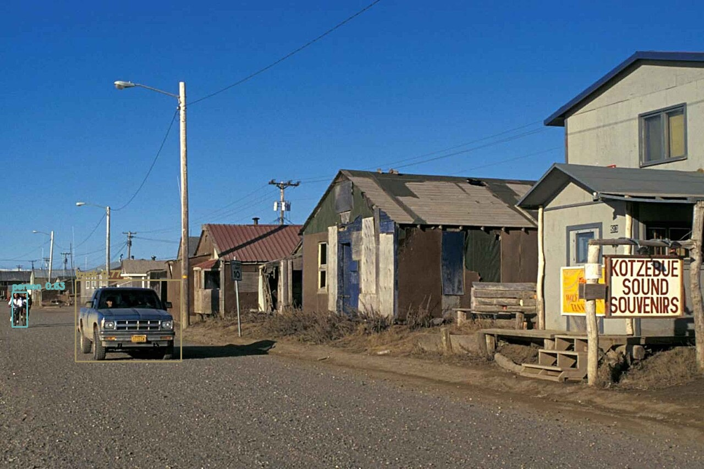
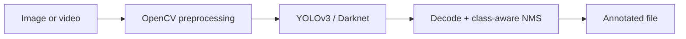

<div align="center">

# DroneAtlas

**A headless OpenCV/YOLOv3 prototype for annotating objects in still images and video.**


</div>

DroneAtlas modernises an early computer-vision experiment into a small, testable Python package. It loads the original YOLOv3 Darknet model through OpenCV, applies class-aware non-maximum suppression, and writes annotated media without opening GUI windows.

| Public-domain input | YOLOv3 output |
| --- | --- |
|  |  |

The checked-in output was generated with the documented command and the official pretrained YOLOv3 weights. The source image is a U.S. Fish and Wildlife Service public-domain photograph; full provenance is recorded in [assets/demo/README.md](assets/demo/README.md). Personal source media is not part of this repository.

## What it does

- Runs COCO-pretrained YOLOv3 inference on one image or video.
- Combines objectness and class probability, then applies class-aware NMS.
- Uses deterministic class colours across runs.
- Keeps model files and generated media outside Git.
- Exposes importable detector and media APIs as well as a CLI.



## Quick start

Requires Python 3.11 or newer. In a virtual environment:

```bash
python -m pip install -e .
python scripts/download_models.py --model yolov3
```

Run an image:

```bash
python -m drone_atlas image \
  --input assets/demo/input.jpg \
  --output outputs/detected.jpg \
  --model-dir models
```

Run a video:

```bash
python -m drone_atlas video \
  --input input.mp4 \
  --output outputs/detected.mp4 \
  --model-dir models \
  --confidence 0.5 \
  --nms 0.4
```

Use `--config`, `--weights`, and `--labels` to supply model files outside the model directory. Run `python -m drone_atlas image --help` for all options.

## Project structure

```text
src/drone_atlas/       Detector, decoding, media workflows and CLI
scripts/               Reproducible model downloader
tests/                 Model-free unit and CLI tests
assets/demo/           Provenance-recorded input and generated result
```

## Development

```bash
python -m pip install -e ".[dev]"
python -m pytest
```

Tests do not download or execute a neural-network model. CI exercises the pure decoding logic, OpenCV compatibility helpers, deterministic colours, and CLI validation.

## Scope and limitations

This is a portfolio reconstruction of an early inference prototype, not a custom-trained detector, drone-control stack, benchmark, or production surveillance system. Accuracy inherits the limitations of pretrained YOLOv3 on COCO. Video processing is offline, CPU-safe by default, and does not perform tracking, geolocation, or model training.

Model and data provenance are documented in [NOTICE.md](NOTICE.md). No project licence has been selected.
